# Chassis design: the two planes, the buckets, and the layers

This is the "why does chassis exist and why is it shaped this way" document. It merges three
questions that are answered separately everywhere else in the repo: what problem chassis solves,
*how strict* each piece is (the bucket axis), and *what each piece is for* (the layer axis).

## The problem

Solo, agent-driven development needs guardrails enforced **from commit 1**, not bolted on later
— coding agents are fast enough that by the time you notice you need import boundaries, a
coverage floor, or secret scanning, an agent has already committed a few hundred lines without
them. And those guardrails need to reach every future project without manual effort.

GitHub template repos are one-time copies — stamped projects never receive improvements.
Copier's `copier update` propagates base improvements into stamped projects (conflicts surfaced,
not silently lost). The chassis is a compounding asset: improvements flow downstream for free.

## The two planes

Everything else in this doc assumes a distinction worth spelling out on its own: **chassis and
the thing you build with it are two different planes, governed by two different sets of
concerns.**

**Plane 1 — how the software gets built.** The dev process. The agent (human + AI, working
together) writing code, running tests, making commits. Chassis lives entirely here: guardrails,
the coaching loop, the devcontainer, the AI-usage cockpit. Its unit of concern is *this
session, this commit, this PR* — did the work go well, did a mistake get corrected once and
never repeated, is the codebase in a state the next session can pick up cleanly.

**Plane 2 — what the software does once it's built.** The shipped product. If what you're
building is itself an AI agent (chassis's primary use case, though not its only one), Plane 2 is
that agent's own runtime architecture: how it turns language into tool calls, how it manages its
own execution state, how it's triggered, how it talks to humans. Its unit of concern is
*production traffic*.

Two mistakes follow directly from collapsing this distinction:

**Mistake 1: importing Plane-2 concerns into chassis.**
[12-factor-agents](https://github.com/humanlayer/12-factor-agents) is a Plane-2 framework —
it's about how to architect a *shipped* agent. Ten of its twelve factors (F1, F4, F6, F7,
F9–F12) don't belong in chassis at all, because chassis doesn't know what you're shipping. If
chassis tried to prescribe "how your agent should manage execution state" (F5) or "how your
agent should be triggered" (F11), it would be making product decisions on your behalf. Exactly
two factors are different, because they describe how *any* agent works — including the one
currently building your software inside this devcontainer: **F2 (Own your Prompts)** and
**F3 (Own your Context Window)**. Those two get dedicated layers below; the other ten don't.

**Mistake 2: importing Plane-1 tooling into Plane-2's quality bar.** The AI-usage cockpit
closes a loop for the *dev process* — `/dev-coach` turns a repeated correction into a durable
`AGENTS.md` rule. That is not the same loop a shipped product needs. A shipped agent's quality
loop runs on production traces and eval scores (turn a bad production response into a
regression test), not on `git log` and session transcripts. Chassis's `evals/` slot (bucket D)
exists specifically so that when you're ready to build Plane 2's quality loop, there's a slot
already provisioned — but chassis doesn't populate it, because it can't know your product's
eval criteria in advance.

A concrete example: you're using chassis to build a customer-support agent. Plane 1 is you and
Claude Code writing the support agent's code, in a devcontainer chassis provisioned, with the
cockpit watching *your* sessions and `/dev-coach` making sure you don't keep re-explaining the
same architectural constraint. Plane 2 is the support agent itself, once deployed, deciding how
to route a ticket and when to escalate to a human. Different agents, different failure modes,
different loops. Chassis only ever touches the first one.

## The bucket axis: how strict is it

Every tool is wired in from day one. What varies is *how it behaves*:

- **A (Blocking):** fails the commit or CI run. Used for things where "wrong" is always wrong —
  secret leaks, import boundary violations, self-weakening patterns.
- **B (Ratcheting):** present from day one, threshold only ever increases. Coverage floor is the
  canonical example: start at 0%, raise as you write tests, never lower.
- **C (On-demand):** installed, never blocks. Run when useful. The AI-usage cockpit lives here.
- **D (Wired-but-waiting):** the job/slot exists in CI and config from day one, but it's a no-op
  until its input exists. The eval gate needs a model call; the arch-drift gate needs an
  architecture model. The slot means the gate is trivially activatable — no retrofit.

## The layer axis: what is it for

A layer answers "what problem does this solve." A bucket answers "what happens if you ignore
it." Every piece of chassis has one answer to each question.

```mermaid
flowchart BT
    subgraph Foundation["Foundation — day 0, always active"]
        direction BT
        Substrate["<b>Substrate</b><br/>devcontainer: image → tools → cache volumes → host mounts"]
        Governance["<b>Governance</b> — bucket A (blocking)<br/>permissions.allow · Forbidden Patterns · ask-before-destructive"]
        Guardrails["<b>Guardrails</b> — bucket A (blocking)<br/>ruff · mypy · import-linter · opengrep · gitleaks"]
        Prompts["<b>Prompts</b> — bucket A (blocking) · 12FA F2<br/>prompts/ convention, no-inline-literal rule"]
        Ratchet["<b>Ratchet</b> — bucket B (ratcheting)<br/>coverage floor · complexity ceiling"]
        Substrate --> Governance --> Guardrails --> Prompts --> Ratchet
    end

    subgraph Cockpit["Runtime cockpit — active while working"]
        direction BT
        Memory["<b>Memory</b> — bucket A (git-tracked)<br/>.agents/memory/ · curated, deliberate, durable"]
        Context["<b>Context Engineering</b> — bucket C (on-demand) · 12FA F3<br/>graphify · ctx · automatic, exhaustive"]
        Tools["<b>Tools/Skills</b> — bucket C (on-demand)<br/>.agents/skills/ · SKILL.md standard · canonical-then-adapt"]
        Coaching["<b>Coaching</b> — bucket C (on-demand)<br/>dev-coach · AI Engineer Coach · codeburn · abtop"]
        Memory --> Context --> Tools --> Coaching
    end

    subgraph Readiness["Readiness — dormant until activated"]
        ReadinessLayer["<b>Readiness</b> — bucket D (wired-waiting)<br/>evals/ · ADLC gate · arch-drift slot"]
    end

    Foundation --> Cockpit --> Readiness

    Product["<b>Plane-2 — The Product</b><br/>12FA F1, F4-F12: your architecture decisions<br/><i>not chassis's job</i>"]
    Readiness -.->|built on top of, using| Product

    style Product stroke-dasharray: 5 5
```

| Layer | Answers | 12FA anchor | Mechanism | Bucket |
|---|---|---|---|---|
| **Substrate** | What does this even run on? | — | Devcontainer's 4-sub-layer model: image → toolchain → cache volumes → host mounts | — |
| **Governance** | Is the *agent* allowed to take this action? | — | `permissions.allow`, `AGENTS.md` Forbidden Patterns, ask-before-destructive conventions | A |
| **Guardrails** | Does the *code* meet the bar? | — | ruff, mypy, import-linter, opengrep self-weakening, gitleaks | A |
| **Prompts** | Where do prompts live, how are they versioned? | F2 — Own your Prompts | `prompts/` convention; no inline literal over 200 chars | A |
| **Ratchet** | What quality bar only ever goes up? | — | Coverage floor, complexity ceiling | B |
| **Memory** | What did we deliberately choose to remember forever? | — (adjacent to F3, but curated not automatic) | `.agents/memory/` — git-tracked, one file per insight, `MEMORY.md` index | A (git-tracked) |
| **Context Engineering** | How does the agent spend fewer tokens re-discovering what's already known? | F3 — Own your Context Window | `graphify` (structure), `ctx` (session recall) | C |
| **Tools/Skills** | How do new capabilities get provisioned, portably? | — | `.agents/skills/` (SKILL.md open standard) + `.claude/skills` symlink — canonical-then-adapt | C |
| **Coaching** | How does friction turn into a durable rule? | — (meta: F2/F3 applied reflexively) | `/dev-coach`, AI Engineer Coach, `codeburn`/`abtop` — consumes Memory + Context Engineering + Tools | C |
| **Readiness** | What's provisioned now so it's trivial to activate later? | — | `evals/`, ADLC agent-change gate, arch-drift slot | D |

### Determinism is the point of the Foundation group

An agent's output is non-deterministic — the same prompt can produce different code on different
runs. Governance, Guardrails, Prompts, and Ratchet exist as a group specifically to wrap that
non-determinism in checks that *aren't*: `ruff`/`mypy`/`import-linter` don't care who or what
wrote the code, only whether it passes; the coverage floor only ever ratchets up regardless of
who raised it. The Cockpit layers are the opposite of this on purpose: they're advisory, not
gates (bucket C, "never blocks"). Determinism belongs in Foundation; judgment calls about
what's worth remembering belong in the Cockpit. Mixing the two — making a cockpit tool block a
commit, or making a guardrail advisory — breaks the model.

### Memory vs. Context Engineering: curated vs. exhaustive

Both layers deal with "what the agent knows," from opposite directions. Memory is small,
deliberate, and durable by construction (someone decided *this specific fact* was worth keeping
— it's in git, it doesn't decay). Context Engineering is large, automatic, and exhaustive by
construction (`ctx` indexes *every* session transcript whether or not anything in it turned out
to matter). `/dev-coach` exists specifically to find the gap between them: something `ctx`
shows really happened (a correction, a repeated mistake) that never made it into a Memory file
— that gap is the signal worth turning into an `AGENTS.md` rule.

### Tools/Skills: the same portability pattern, twice

Chassis ships exactly one adapter pattern, applied to two different things: keep a canonical,
harness-agnostic copy in the repo, and symlink it to wherever the *current* harness happens to
look.

- **Memory**: canonical at `.agents/memory/` (git-tracked) → symlinked to
  `~/.claude/projects/<slug>/memory` (Claude Code's own convention) by `post-create.sh`.
- **Skills**: canonical at `.agents/skills/` (the vendor-agnostic SKILL.md open standard) →
  symlinked to `.claude/skills/` (Claude Code's own convention).

If the harness changes — Claude Code today, something else later — only the thin symlink
adapter needs to change. The canonical content, and the discipline of keeping it in git,
doesn't move.

## The harness plane: what chassis will and won't put between an agent and its context

Chassis's Plane 1 *is* the harness plane — the layer between the model and the codebase:
settings, hooks, permissions, context tools, the observation path. Any tool proposed for the
cockpit gets classified by **where it sits in the agent's observation/action path**:

1. **Observers** — read session logs or repo state after the fact (`codeburn`, `abtop`,
   AI Engineer Coach). Admissible, with version pinning.
2. **Advisors** — on-demand, agent-invoked, purely additive context (`graphify` queries,
   `ctx search`, skills, memory). Admissible — their failure mode is staleness or non-use,
   not deception. This is bucket C's definition.
3. **Gates** — deterministically block actions and **fail loudly** (pre-commit, CI, ratchets,
   a PreToolUse deny that states its reason). Admissible: a visible block can be argued with;
   it never lies.
4. **Interceptors** — sit inside the read path and silently transform what the agent perceives
   (token-optimizer shell hooks, output filters, API-rewriting proxies). **Never admissible as
   a template default**, regardless of the token savings claimed. Devcontainers and the
   settings.json carve-out contain *substrate* risk (rogue config writes); no isolation
   boundary contains *epistemic* risk — a filter inside a pristine container still lies to the
   agent inside it, and the tool that causes the error also hides the evidence of the error.

The litmus test: *does it silently transform what the agent perceives on the hot path?* If yes,
it's out — [ADR-004](../decisions/adrs/adr-004-no-silent-rewriters.md) has the full evidence,
including why independently measured savings from this tool category consistently fail to match
vendor claims, and the criteria under which that decision would be revisited.

Token frugality is solved on the demand side instead: `graphify` (don't re-discover structure),
`ctx` (don't re-derive decisions), memory/skills (don't re-learn lessons), `/dev-coach` (turn
repeat-reads into durable rules) — plus the harness's own native mechanisms (prompt caching,
compaction, subagent isolation, progressive skill disclosure), which cover the same ground as
interceptor tools without anyone rewriting the agent's observations. Fix the cause of
re-reading; don't compress the symptom.

## The thin-chassis discipline

Resist feature creep. The chassis should be the minimum that makes every project *start right*,
not a superset that makes new projects *start slow*. The acceptance test is the forcing
function: `just accept` stamps a throwaway project and checks its `just ci` passes, end to end
— the same determinism principle applied to chassis itself. If `just accept` takes more than
~2 minutes, the chassis is too heavy.

## How this relates to the other explanation docs

- [The AI-usage cockpit](ai-usage-cockpit.md) — the Context Engineering and Coaching layers,
  expanded: what each of the five tools does and how the loop closes back into `AGENTS.md`.
- [Devcontainer persistence](devcontainer-persistence.md) — the Substrate layer, expanded: what
  survives a rebuild and what doesn't.
- [ADR log](../decisions/adrs/) — the decision records behind the lines drawn here.
