# The layered model

Chassis organizes along **two orthogonal axes**. Confusing the two is the easiest way to
misread this repo, so they're kept separate everywhere:

- **What is it for** — the *capability layer* (memory, context engineering, governance, …).
  This is what this document is about.
- **How strict is it** — the *bucket* (A/B/C/D): blocking, ratcheting, on-demand, or
  wired-but-waiting. See [Why a Copier chassis?](chassis-design.md) for that axis in full.

A layer answers "what problem does this solve." A bucket answers "what happens if you ignore
it." Every piece of chassis has one answer to each question.

## The diagram

```mermaid
flowchart BT
    subgraph Foundation["Foundation — day 0, always active"]
        direction BT
        Substrate["<b>Substrate</b><br/>devcontainer: image → tools → cache volumes → host mounts"]
        Governance["<b>Governance</b> — bucket A (blocking)<br/>permissions.allow · Forbidden Patterns · ask-before-destructive"]
        Guardrails["<b>Guardrails</b> — bucket A (blocking)<br/>ruff · mypy · import-linter · opengrep · gitleaks"]
        Prompts["<b>Prompts</b> — bucket A (blocking) · 12FA F2<br/>prompts/ convention, no-inline-literal rule"]
        Ratchet["<b>Ratchet</b> — bucket B (ratcheting)<br/>coverage floor · complexity ceiling"]
        Substrate --> Governance --> Guardrails --> Prompts --> Ratchet
    end

    subgraph Cockpit["Runtime cockpit — active while working"]
        direction BT
        Memory["<b>Memory</b> — bucket A (git-tracked)<br/>.agents/memory/ · curated, deliberate, durable"]
        Context["<b>Context Engineering</b> — bucket C (on-demand) · 12FA F3<br/>graphify · ctx · lean-ctx · automatic, exhaustive"]
        Tools["<b>Tools/Skills</b> — bucket C (on-demand)<br/>.agents/skills/ · SKILL.md standard · canonical-then-adapt"]
        Coaching["<b>Coaching</b> — bucket C (on-demand)<br/>dev-coach · AI Engineer Coach · codeburn · abtop"]
        Memory --> Context --> Tools --> Coaching
    end

    subgraph Readiness["Readiness — dormant until activated"]
        ReadinessLayer["<b>Readiness</b> — bucket D (wired-waiting)<br/>evals/ · ADLC gate · arch-drift slot"]
    end

    Foundation --> Cockpit --> Readiness

    Product["<b>Plane-2 — The Product</b><br/>12FA F1, F4-F12: your architecture decisions<br/><i>not chassis's job</i>"]
    Readiness -.->|built on top of, using| Product

    style Product stroke-dasharray: 5 5
```

Read bottom-to-top: Foundation is enforced from commit 1 regardless of whether you're actively
working. The Cockpit only does anything while an agent is actually in the loop. Readiness sits
dormant until its input exists. Everything below the dashed line is chassis's job; the product
above it deliberately isn't.

## The layers, one row per question

| Layer | Answers | 12FA anchor | Mechanism | Bucket |
|---|---|---|---|---|
| **Substrate** | What does this even run on? | — | Devcontainer's 4-sub-layer model: image → toolchain → cache volumes → host mounts | — |
| **Governance** | Is the *agent* allowed to take this action? | — | `permissions.allow`, `AGENTS.md` Forbidden Patterns, ask-before-destructive conventions | A |
| **Guardrails** | Does the *code* meet the bar? | — | ruff, mypy, import-linter, opengrep self-weakening, gitleaks | A |
| **Prompts** | Where do prompts live, how are they versioned? | F2 — Own your Prompts | `prompts/` convention; no inline literal over 200 chars | A |
| **Ratchet** | What quality bar only ever goes up? | — | Coverage floor, complexity ceiling | B |
| **Memory** | What did we deliberately choose to remember forever? | — (adjacent to F3, but curated not automatic) | `.agents/memory/` — git-tracked, one file per insight, `MEMORY.md` index | A (git-tracked) |
| **Context Engineering** | How is the working context window managed, automatically? | F3 — Own your Context Window | `graphify` (structure), `ctx` (exhaustive session history), `lean-ctx` (compression) | C |
| **Tools/Skills** | How do new capabilities get provisioned, portably? | — | `.agents/skills/` (SKILL.md open standard) + `.claude/skills` symlink — canonical-then-adapt | C |
| **Coaching** | How does friction turn into a durable rule? | — (meta: F2/F3 applied reflexively) | `/dev-coach`, AI Engineer Coach, `codeburn`/`abtop` — consumes Memory + Context Engineering + Tools | C |
| **Readiness** | What's provisioned now so it's trivial to activate later? | — | `evals/`, ADLC agent-change gate, arch-drift slot | D |

## Determinism is the point of the Foundation group

An agent's output is non-deterministic — the same prompt can produce different code on different
runs, from different agents, or from the same agent on a bad day. Governance, Guardrails, Prompts,
and Ratchet exist as a group specifically to wrap that non-determinism in checks that *aren't*:
`ruff`/`mypy`/`import-linter` don't care who or what wrote the code, only whether it passes; the
coverage floor only ever ratchets up regardless of who raised it; pre-commit hooks and `just
ci`/`ci-*` in CI run the identical check whether a human or an agent made the change. This is
also why `just accept` — stamping a throwaway project and checking its `just ci` is green — is
chassis's own forcing function: it's the same principle applied to chassis itself, not just to
what chassis produces.

The Cockpit layers are the opposite of this on purpose: they're advisory, not gates (bucket C,
"never blocks"). Determinism belongs in Foundation; judgment calls about what's worth remembering
or compressing belong in the Cockpit. Mixing the two — making a cockpit tool block a commit, or
making a guardrail advisory — breaks the model.

## Governance is not the same axis as Guardrails

These two get confused because both are bucket A (blocking). The distinction is the *subject*:
Guardrails judge the code an agent produces; Governance judges whether the agent should have
taken the action at all, independent of whether the resulting code would've been fine. A perfectly
correct `curl | sh` in a shared template is still a Governance question (should an agent pipe an
unreviewed remote script into a shell that runs unattended for every future project?), not a
Guardrails one (ruff has no opinion on this). Chassis's Governance layer today is thin —
`permissions.allow` plus a Forbidden Patterns list — deliberately: most of the actual enforcement
lives in the harness itself (Claude Code's own auto-mode classifier), and chassis's job is just
to pre-authorize the things that are genuinely safe by default, not to reimplement a policy engine.

## Memory vs. Context Engineering: curated vs. exhaustive

Both layers deal with "what the agent knows," but from opposite directions. Memory is small,
deliberate, and durable by construction (a human or agent decided *this specific fact* was worth
keeping — it's in git, it doesn't decay). Context Engineering is large, automatic, and exhaustive
by construction (`ctx` indexes *every* session transcript whether or not anything in it turned
out to matter; `lean-ctx` compresses *whatever* gets read, not just what's important). `/dev-coach`
exists specifically to find the gap between them: something `ctx` shows really happened (a
correction, a repeated mistake) that never made it into a Memory file — that gap is the signal
worth turning into an `AGENTS.md` rule.

## Tools/Skills: the same portability pattern, twice

Chassis ships exactly one adapter pattern, applied to two different things: keep a canonical,
harness-agnostic copy in the repo, and symlink it to wherever the *current* harness happens to
look.

- **Memory**: canonical at `.agents/memory/` (git-tracked) → symlinked to
  `~/.claude/projects/<slug>/memory` (Claude Code's own convention) by `post-create.sh`.
- **Skills**: canonical at `.agents/skills/` (the vendor-agnostic SKILL.md open standard) →
  symlinked to `.claude/skills/` (Claude Code's own convention).

The point of the pattern: if the harness changes — Claude Code today, something else later — only
the thin symlink adapter needs to change. The canonical content, and the discipline of keeping it
in git, doesn't move. This is the same "own the contract, swap the engine" idea applied to agent
tooling instead of to cloud infrastructure.

## Why 12-factor-agents only shows up twice

[12-factor-agents](https://github.com/humanlayer/12-factor-agents) is a framework for
architecting a **shipped agent product** — the thing you build using chassis, not chassis
itself. Ten of its twelve factors (F1, F4, F6, F7, F9–F12) are decisions about *that product's*
runtime: how it turns language into tool calls, how it manages execution state, how it contacts
humans, how it's triggered. Chassis has no opinion on any of that — it can't, since it doesn't
know what you're building.

Exactly two factors are different, because they describe how *any* agent works — including the
one currently building your software inside this devcontainer:

- **F2 (Own your Prompts)** applies to the dev-agent's own skills and instructions just as much
  as to whatever the shipped product prompts its model with.
- **F3 (Own your Context Window)** applies to the dev-agent's context management (what `ctx` and
  `lean-ctx` are for) exactly as much as it applies to the shipped product's.

That's the whole reason those two get a dedicated layer here and the other ten don't — it's not
an oversight, it's the Plane-1/Plane-2 boundary (see [the two-plane model](two-plane-model.md))
drawn precisely at the two factors that cross it.

## How this relates to the other explanation docs

- [The two-plane model](two-plane-model.md) — the Plane-1/Plane-2 boundary this document draws
  at F2/F3, explained on its own terms with a concrete example.
- [Why a Copier chassis?](chassis-design.md) — the bucket axis (A/B/C/D) in full, plus why Copier
  over a template repo, and the thin-chassis discipline.
- [The AI-usage cockpit](ai-usage-cockpit.md) — the Context Engineering and Coaching layers,
  expanded: what each of the six tools does and how the loop closes back into `AGENTS.md`.
- [Devcontainer persistence](devcontainer-persistence.md) — the Substrate layer, expanded: what
  survives a rebuild and what doesn't.
